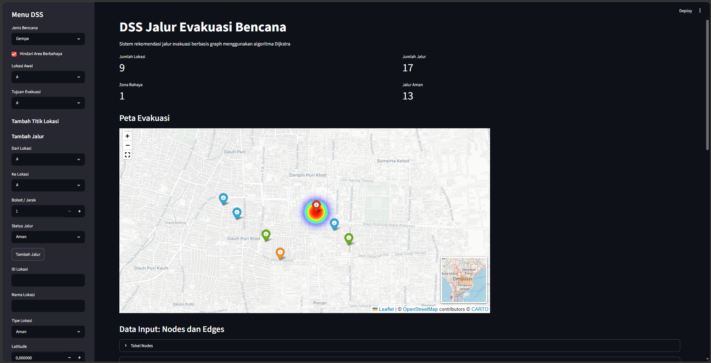
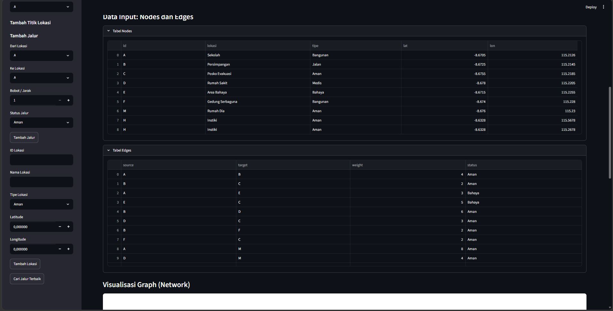
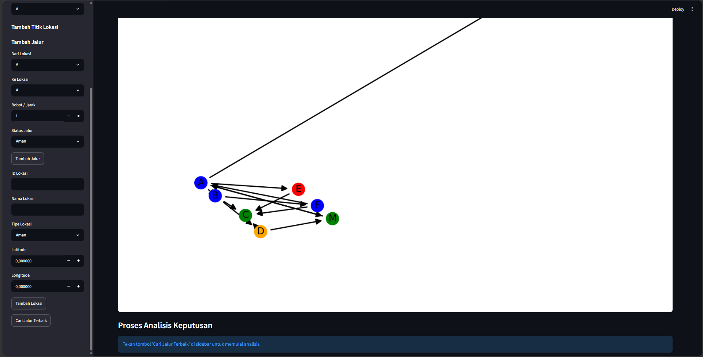
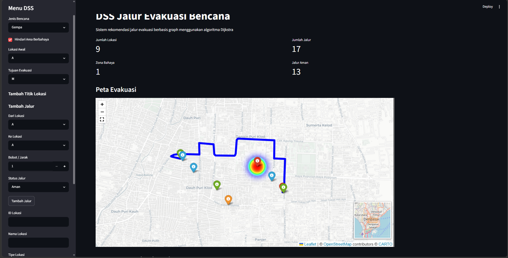
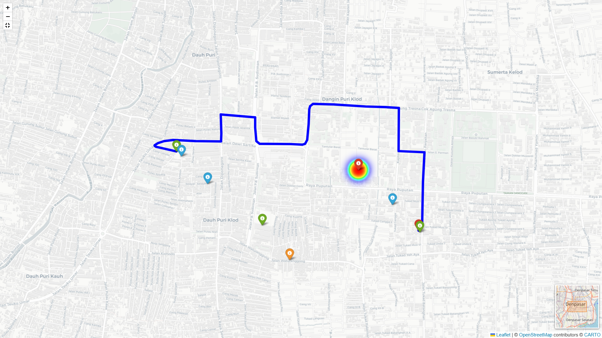

# Nama Anggota Kelompok:
1. Dewa Gede Reihan Waiswana - 2501010122
2. I Gede Ega Sanjaya Putra - 2501010099
3. I Ketut Kayana Pradhitya - 2501010112

# DSS Jalur Evakuasi Bencana

Sistem Decision Support System (DSS) berbasis graph untuk menentukan jalur evakuasi terbaik menggunakan algoritma Dijkstra.

## Features 💡
- Interactive evacuation map
- Real-time route visualization
- Weighted graph
- Adaptive risk scoring
- API integration
- Heatmap danger zone
- Route recommendation

## Technologies 🕹️
- Python
- Streamlit
- Folium
- OpenRouteService API
- NetworkX
- Pandas

## Installation ⚙️

```bash
pip install -r requirements.txt
```

## Preview 🖼️

### Dashboard ✨




### Route 📍


### Map 🗺️

